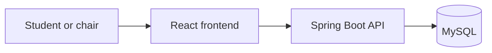

# CECAS

**Canvas Extra Credit Automation System**

CECAS is a demo app for handling extra credit requests. Students propose activities, upload evidence after pre-approval, and track their points. Program chairs review requests and give feedback.

CECAS does not connect to Canvas. Requests and points are stored in the app's own database.

[Live app](https://cecas.dafinnell.com) · [Source code](https://github.com/DAFinnell/Cecas) · [Derek Finnell's portfolio](https://dafinnell.com)

> This is a portfolio demo, not a university service.

## How a Request Moves Through CECAS

1. A student registers and submits an extra credit request.
2. The assigned program chair reviews the proposed activity.
3. The chair either pre-approves the request or rejects it with feedback.
4. After pre-approval, the student uploads evidence that they completed the activity.
5. The chair reviews the evidence, leaves feedback, and approves or rejects the request.
6. Approved points are added to the student’s semester total.

## Guided Demo

The [live demo](https://cecas.dafinnell.com/demo) lets you try the student side and see screenshots of the program chair side.

### Student Demo

Open the live demo and select **Register a Demo Student Account**. You can submit a request and explore the student dashboard.

When using the demo:

- Use a password you do not use anywhere else.
- Enter sample information only.
- Do not upload private or sensitive files.
- Demo accounts and requests may be deleted during a reset.

### Program Chair Walkthrough

The chair walkthrough uses screenshots. A shared chair login would let visitors change the requests, feedback, and points that other people see.

### Student Dashboard


*The student dashboard keeps semester points, request statuses, and next actions in one place.*

### Pre-Approved Student Request


*After pre-approval, the student can read the chair’s feedback and upload evidence.*

### Program Chair Dashboard


*The chair dashboard separates new requests from requests that are ready for evidence review.*

### Evidence Review and Final Decision


*The final review records the evidence, feedback, decision, and awarded points.*

## How CECAS Is Built



React displays the pages. The Spring Boot API handles sign-in, review rules, and requests to the database. MySQL stores accounts, courses, requests, feedback, and points.

Locally, Docker Compose starts these services together. Flyway sets up the database, and CSV seed files add sample courses, categories, and chair assignments. Mailpit is available for email development; the current request workflow does not send notification emails.

## Technology Stack

- **Frontend:** React, TypeScript, Vite, and Tailwind CSS
- **Backend:** Java 21, Spring Boot, Spring Security, and Spring Data JPA
- **Database:** MySQL with Flyway migrations
- **Local development:** Docker Compose, CSV seed data, and Mailpit
- **Testing:** Vitest and React Testing Library on the frontend; JUnit, Spring Boot Test, and Testcontainers on the backend

## Project Background

CECAS began as a six-student Franklin University capstone. I maintain this version as a portfolio demo.

## Run CECAS Locally

### Prerequisites

Install:

- [Docker Desktop](https://www.docker.com/products/docker-desktop/)
- [Git](https://git-scm.com/downloads)

Docker Compose runs the frontend, backend, MySQL database, and supporting local services. You do not need to install Java, Maven, Node.js, or MySQL separately just to run the complete application.

### First-Time Setup

1. Clone this repository and enter the project directory:

```bash
git clone https://github.com/DAFinnell/Cecas.git
cd Cecas
```

2. Create your local environment file:

```bash
cp .env.example .env
```

3. Build and start the application:

```bash
docker compose up --build -d
```

4. Open the application and local tools:

- Application: [http://localhost:5173](http://localhost:5173)
- Guided demo: [http://localhost:5173/demo](http://localhost:5173/demo)
- Backend health check: [http://localhost:8080/actuator/health](http://localhost:8080/actuator/health)
- Mailpit: [http://localhost:8025](http://localhost:8025)

### Common Docker Commands

Start the application after completing the first-time setup:

```bash
docker compose up -d
```

Rebuild the frontend and backend images after changing application code or dependencies:

```bash
docker compose up --build -d
```

Stop the application without deleting its local data:

```bash
docker compose down
```

### Seed Data

During local startup, Flyway prepares the database structure before the seed system loads sample reference data. Startup seeding is controlled by `APP_SEED_ENABLED` in the local `.env` file.

The seed files are stored in:

```text
backend/src/main/resources/seed/
├── categories.csv
├── chairs.csv
└── courses.csv
```

These files provide:

- Activity categories and their default point values
- Chair accounts and course assignments
- Available courses, terms, and sections

The seed directory is mounted into the backend container as read-only. Editing a CSV file changes the file available to the container, but it does not immediately update records already stored in MySQL.

After editing a seed file, synchronize the current local database with the new reference data:

```bash
make seed
```

Use `make seed` for normal seed updates. It synchronizes courses, categories, chair accounts, and chair assignments without intentionally deleting student requests or rebuilding the database.

To completely rebuild the local environment from the current Flyway migrations and seed files:

```bash
make reset-db
```

> **Warning:** `make reset-db` runs `docker compose down -v`. It deletes this project’s local MySQL database, uploaded evidence, and named frontend dependency volume before rebuilding the application. Only use it when you intentionally want a clean local environment.

## Testing

You do not need these commands just to run CECAS with Docker. They are useful when changing the app.

From `frontend/`:

```bash
npm ci
npm run format:check
npm run lint
npm test
npm run build
```

From `backend/`, with Docker Desktop running for the database-backed tests:

```bash
./mvnw spotless:check
./mvnw test
```

## Technical Documentation

- [Request Lifecycle](docs/request-lifecycle.md)
- [Seed System Overview](docs/seed-system.md)

## License

No open-source license has been added to this repository.
