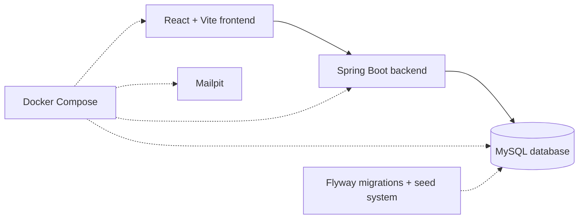

# CECAS

**Canvas Extra Credit Automation System**

CECAS brings the full extra credit request process into one place. Students can submit activities, follow their request status, upload evidence, and see awarded points. Program chairs can review requests, leave feedback, and make both pre-approval and final decisions.

[Explore the guided demo locally](http://localhost:5173/demo) · [Derek Finnell’s portfolio](https://dafinnell.com) · [GitHub profile](https://github.com/DAFinnell) · [Project source](https://github.com/DAFinnell/Cecas)

> CECAS is a team-built capstone presented as a portfolio project. It is not a live university service.

## The Problem

Extra credit requests can be difficult to follow when activity details, evidence, feedback, and decisions are spread across email threads and separate records. Students may not know what happens next, while program chairs have to keep track of requests at several different stages.

## The Solution

CECAS keeps the complete request in one system:

- Students submit proposed activities and follow each request from start to finish.
- Program chairs review new requests, explain rejections, and pre-approve eligible activities.
- Students upload evidence after receiving pre-approval.
- Program chairs review the evidence and make the final decision.
- Approved points are added to the student’s semester total.

## How a Request Moves Through CECAS

1. A student registers and submits an extra credit request.
2. The assigned program chair reviews the proposed activity.
3. The chair either pre-approves the request or rejects it with feedback.
4. After pre-approval, the student uploads evidence that they completed the activity.
5. The chair reviews the evidence, leaves feedback, and approves or rejects the request.
6. Approved points are added to the student’s semester total.

## Guided Demo

The guided demo provides two ways to explore the project.

### Student Demo

After starting CECAS locally, open the [guided demo](http://localhost:5173/demo) and select **Register a Demo Student Account**. You can create a student account, submit a request, and explore the student dashboard.

When using the demo:

- Use a password you do not use anywhere else.
- Enter sample information only.
- Do not upload private or sensitive files.
- Demo accounts and requests may be deleted during a reset.

### Program Chair Walkthrough

Chair accounts are not shared publicly because one visitor could change the requests, feedback, and points seen by everyone else. The guided demo uses screenshots to show the chair workflow without publishing a chair password.

### Student Dashboard


*The student dashboard keeps semester points, request statuses, and next actions in one place.*

### Pre-Approved Student Request


*After pre-approval, the student can read the chair’s feedback and upload evidence.*

### Program Chair Dashboard


*The chair dashboard separates new requests from requests that are ready for evidence review.*

### Evidence Review and Final Decision


*The final review records the evidence, feedback, decision, and awarded points.*

## How CECAS Is Built



The React frontend displays the student and chair pages. It sends requests to the Spring Boot backend, which handles authentication, workflow rules, and database access. MySQL stores accounts, courses, requests, feedback, and awarded points.

Docker Compose starts the local services together. Flyway prepares the database structure, while the seed system adds sample courses, categories, and chair assignments. Mailpit is included in the local Docker setup for email testing, although the current request workflow does not send notification emails.

## Technology Stack

- **Frontend:** React, TypeScript, Vite, and Tailwind CSS
- **Backend:** Java 21, Spring Boot, Spring Security, and Spring Data JPA
- **Database:** MySQL with Flyway migrations
- **Local development:** Docker Compose, CSV seed data, and Mailpit
- **Production frontend:** Nginx configuration for serving the built React application
- **Testing:** Vitest and React Testing Library on the frontend; JUnit, Spring Boot Test, and Testcontainers on the backend

## Project Background

CECAS began as a six-student Franklin University capstone project. The application and repository history reflect that shared work. This version is maintained by Derek Finnell and presented as part of his software development portfolio.

## Prerequisites

- Docker Desktop (recommended for running all services)

- Git (for version control)

> **Note:**  

> All required services (Spring Boot 4.0.6, React 19.2.6, Tailwind CSS 4.3.0, Mailpit 1.30.0, MySQL 8.4, Flyway 11.14.1) are managed by Docker Compose. 

> You do **not** need to install Java, Maven, Node.js, or MySQL locally unless you want to run services outside Docker for development.

## Set Up and Installation

Details on how to set up the project follow.

Docker Compose runs the following services:

- React frontend
- Spring Boot backend
- MySQL database
- Mailpit for local email testing

### First Time Setup
1. Clone the repository and check out the final release.

```bash
git clone https://github.com/2026-Summer-Franklin-CS-Practicum/2026_Summer_Team5_Repo.git
cd 2026_Summer_Team5_Repo
git checkout v1.0.0
```

2. Create local environment file from the example.

```bash
cp .env.example .env
```

3. Build and start the application

```bash
docker compose up --build -d
```

4. Open the application and supporting services
- Application: http://localhost:5173
- Backend health check: http://localhost:8080/actuator/health
- Mailpit: http://localhost:8025

### Using Docker

To start services:
```bash
docker compose up -d
```

To stop services:
```bash
docker compose down
```

For a full local database rebuild
```bash
make reset-db
```

### Seed Data
A clean Docker startup will run Flyway migrations first and then load the seed files when startup seeding is enabled.

The backend reads seed files from the repository `seed/` directory:
- `courses.csv`
- `categories.csv`
- `chairs.csv`

Important behavior:
- Editing a CSV file by itself does not change the running database.
- Seed changes are only applied when the backend starts with seeding enabled, or when you run the manual reseed command.
- The seed directory is mounted into the backend container as read-only, so seed file updates do not require Java code changes or rebuilding the backend image.

To apply updated seed files without resetting the database:
```bash
make seed
```
Use this command for normal reseeding after editing a seed CSV.
To completely reset the local database and rebuild it from Flyway migrations plus the current seed files:
```bash
make reset-db
```
make reset-db is destructive and is only meant for local development. It is not the normal way to apply seed file changes.

## Git Workflow
Follow these steps to ensure your local code is synchronized with the team's progress.

Update Develop and Create Feature Branch
Always start by pulling the latest changes from the shared develop branch before starting new work.

```bash
git checkout develop
```
```bash
git pull
```
```bash
git checkout -b feature/your-ticket-name
```
## Finished Work: Commit and Push
Once your ticket is complete, stage your changes and push them to the remote repository.
```bash
git add .
```
```bash
git commit -m "ticket name"
```
```bash
git push -u origin feature/your-ticket-name
```
## Open Pull Request into develop on GitHub
Go to the GitHub repository website to open a Pull Request (PR) from your feature branch into develop for review.

## Testing Notes
We are testing against the MySQL database rather than using in memory for consistency and expected behavior.
We have created some custom annotations for testing to streamline things. Use:
- @MySqlDataJpaTest for repository/entity tests
- @MySqlServiceTest for service-layer tests with real Spring + MySQL
- @MySqlMockMvcTest for auth/web integration tests with real Spring + MySQL + MockMvc
- @WebMvcTest for lightweight controller-slice tests

## Documentation
Design and implementation notes for all shared project subsystems.

- [Seed System Overview](docs/seed-system.md)