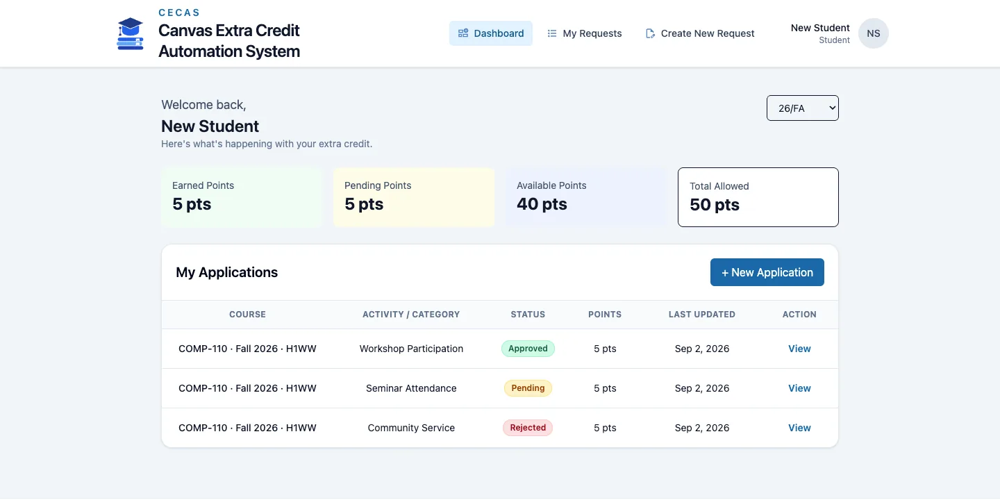
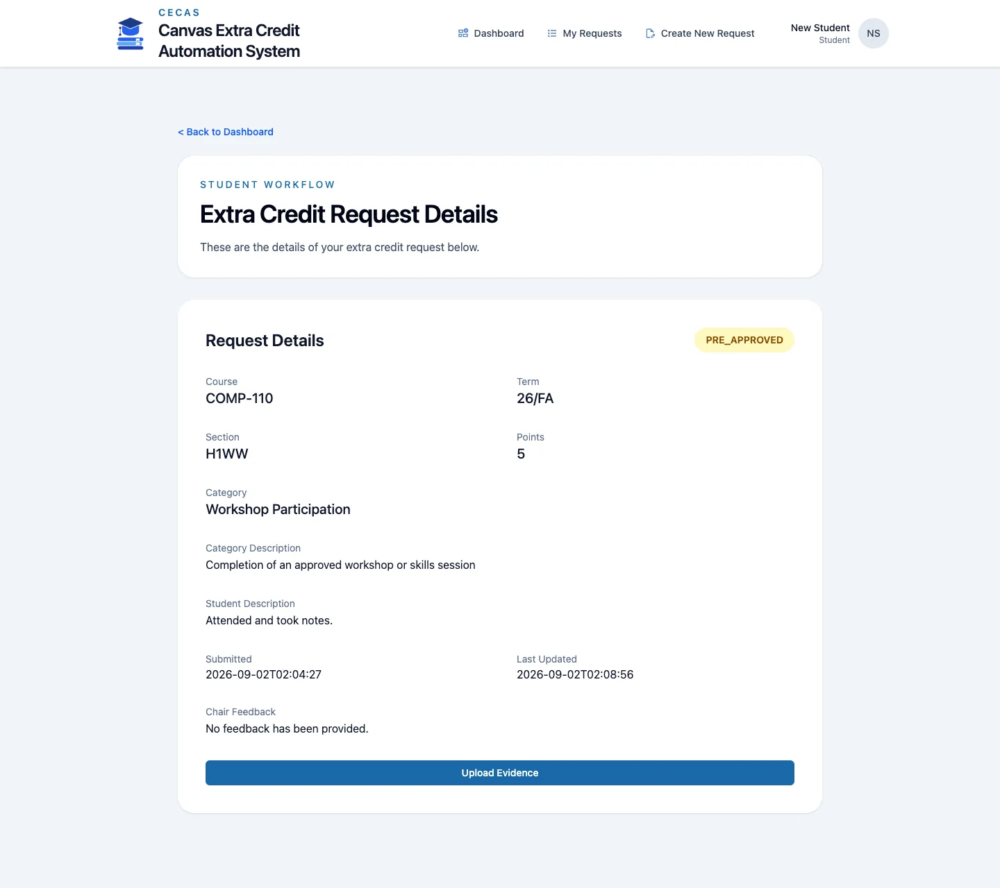
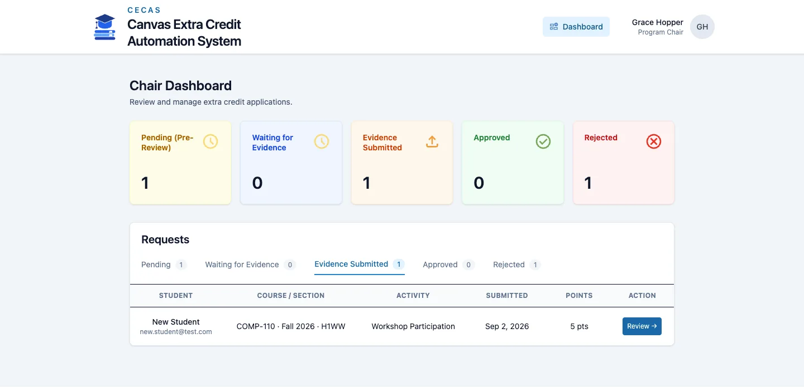
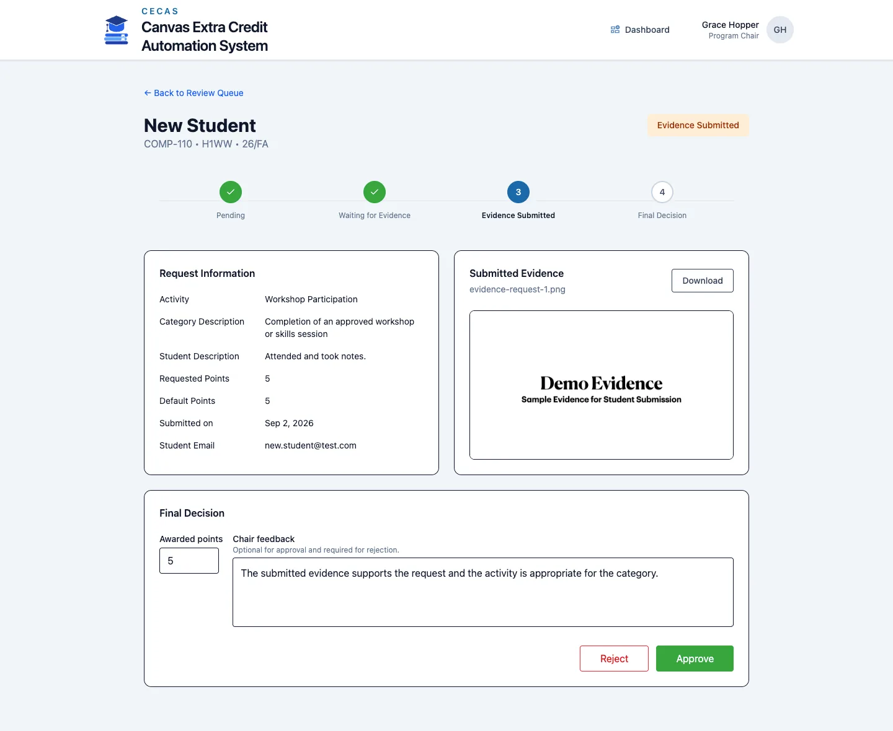
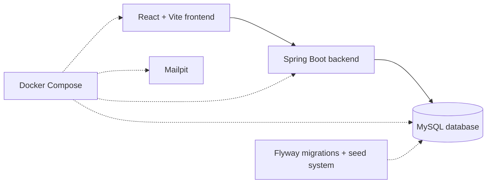

# CECAS

**Canvas Extra Credit Automation System**

CECAS brings the full extra credit request process into one place. Students can submit activities, follow their request status, upload evidence, and see awarded points. Program chairs can review requests, leave feedback, and make both pre-approval and final decisions.

[Explore the guided demo locally](http://localhost:5173/demo) · [Derek Finnell’s portfolio](https://dafinnell.com) · [GitHub profile](https://github.com/DAFinnell) · [Project source](https://github.com/DAFinnell/Cecas)

> CECAS is a team-built capstone presented as a portfolio project. It is not a live university service.

## The Problem

Extra credit requests can be difficult to follow when activity details, evidence, feedback, and decisions are spread across email threads and separate records. Students may not know what happens next, while program chairs have to keep track of requests at several different stages.

## The Solution

CECAS keeps the complete request in one system:

- Students submit proposed activities and follow each request from start to finish.
- Program chairs review new requests, explain rejections, and pre-approve eligible activities.
- Students upload evidence after receiving pre-approval.
- Program chairs review the evidence and make the final decision.
- Approved points are added to the student’s semester total.

## How a Request Moves Through CECAS

1. A student registers and submits an extra credit request.
2. The assigned program chair reviews the proposed activity.
3. The chair either pre-approves the request or rejects it with feedback.
4. After pre-approval, the student uploads evidence that they completed the activity.
5. The chair reviews the evidence, leaves feedback, and approves or rejects the request.
6. Approved points are added to the student’s semester total.

## Guided Demo

The guided demo provides two ways to explore the project.

### Student Demo

After starting CECAS locally, open the [guided demo](http://localhost:5173/demo) and select **Register a Demo Student Account**. You can create a student account, submit a request, and explore the student dashboard.

When using the demo:

- Use a password you do not use anywhere else.
- Enter sample information only.
- Do not upload private or sensitive files.
- Demo accounts and requests may be deleted during a reset.

### Program Chair Walkthrough

Chair accounts are not shared publicly because one visitor could change the requests, feedback, and points seen by everyone else. The guided demo uses screenshots to show the chair workflow without publishing a chair password.

### Student Dashboard



*The student dashboard keeps semester points, request statuses, and next actions in one place.*

### Pre-Approved Student Request



*After pre-approval, the student can read the chair’s feedback and upload evidence.*

### Program Chair Dashboard



*The chair dashboard separates new requests from requests that are ready for evidence review.*

### Evidence Review and Final Decision



*The final review records the evidence, feedback, decision, and awarded points.*

## How CECAS Is Built



The React frontend displays the student and chair pages. It sends requests to the Spring Boot backend, which handles authentication, workflow rules, and database access. MySQL stores accounts, courses, requests, feedback, and awarded points.

Docker Compose starts the local services together. Flyway prepares the database structure, while the seed system adds sample courses, categories, and chair assignments. Mailpit is included in the local Docker setup for email testing, although the current request workflow does not send notification emails.

## Technology Stack

- **Frontend:** React, TypeScript, Vite, and Tailwind CSS
- **Backend:** Java 21, Spring Boot, Spring Security, and Spring Data JPA
- **Database:** MySQL with Flyway migrations
- **Local development:** Docker Compose, CSV seed data, and Mailpit
- **Production frontend:** Nginx configuration for serving the built React application
- **Testing:** Vitest and React Testing Library on the frontend; JUnit, Spring Boot Test, and Testcontainers on the backend

## Project Background

CECAS began as a six-student Franklin University capstone project. The application and repository history reflect that shared work. This version is maintained by Derek Finnell and presented as part of his software development portfolio.

## Run CECAS Locally

### Prerequisites

Install:

- [Docker Desktop](https://www.docker.com/products/docker-desktop/)
- [Git](https://git-scm.com/downloads)

Docker Compose runs the frontend, backend, MySQL database, and supporting local services. You do not need to install Java, Maven, Node.js, or MySQL separately just to run the complete application.

### First-Time Setup

1. Clone this repository and enter the project directory:

```bash
git clone https://github.com/DAFinnell/Cecas.git
cd Cecas
```

2. Create your local environment file:

```bash
cp .env.example .env
```

3. Build and start the application:

```bash
docker compose up --build -d
```

4. Open the application and local tools:

- Application: [http://localhost:5173](http://localhost:5173)
- Guided demo: [http://localhost:5173/demo](http://localhost:5173/demo)
- Backend health check: [http://localhost:8080/actuator/health](http://localhost:8080/actuator/health)
- Mailpit: [http://localhost:8025](http://localhost:8025)

### Common Docker Commands

Start the application after completing the first-time setup:

```bash
docker compose up -d
```

Rebuild the frontend and backend images after changing application code or dependencies:

```bash
docker compose up --build -d
```

Stop the application without deleting its local data:

```bash
docker compose down
```

### Seed Data

During local startup, Flyway prepares the database structure before the seed system loads sample reference data. Startup seeding is controlled by `APP_SEED_ENABLED` in the local `.env` file.

The seed files are stored in:

```text
backend/src/main/resources/seed/
├── categories.csv
├── chairs.csv
└── courses.csv
```

These files provide:

- Activity categories and their default point values
- Chair accounts and course assignments
- Available courses, terms, and sections

The seed directory is mounted into the backend container as read-only. Editing a CSV file changes the file available to the container, but it does not immediately update records already stored in MySQL.

After editing a seed file, synchronize the current local database with the new reference data:

```bash
make seed
```

Use `make seed` for normal seed updates. It synchronizes courses, categories, chair accounts, and chair assignments without intentionally deleting student requests or rebuilding the database.

To completely rebuild the local environment from the current Flyway migrations and seed files:

```bash
make reset-db
```

> **Warning:** `make reset-db` runs `docker compose down -v`. It deletes this project’s local MySQL database, uploaded evidence, and named frontend dependency volume before rebuilding the application. Only use it when you intentionally want a clean local environment.

## Testing

### Frontend

From the `frontend` directory:

```bash
npm ci
npm run format:check
npm run lint
npm test
npm run build
```

These commands install the versions recorded in `package-lock.json`, check formatting, run ESLint, run the frontend test suite, and create a production build.

### Backend

Docker Desktop must be running because the database-backed tests use MySQL Testcontainers.

From the `backend` directory:

```bash
./mvnw spotless:check
./mvnw test
```

The first command checks Java formatting without changing files. The second runs the backend test suite.

The backend includes reusable test annotations for different levels of database-backed testing:

- `@MySqlDataJpaTest` for repository and entity tests
- `@MySqlServiceTest` for service tests using Spring and MySQL
- `@MySqlMockMvcTest` for authentication and web integration tests using Spring, MySQL, and MockMvc
- `@WebMvcTest` for smaller controller tests that do not require the complete application

### Containers

Docker Desktop must be running. From the repository root:

```bash
docker compose --env-file .env.example -f docker-compose.yml config --quiet

BACKEND_IMAGE=cecas-backend:ci \
FRONTEND_IMAGE=cecas-frontend:ci \
DB_HOST=mysql \
MYSQL_DATABASE=cecas \
MYSQL_USER=cecas \
MYSQL_PASSWORD=ci-placeholder \
MYSQL_ROOT_PASSWORD=ci-root-placeholder \
APP_SEED_ENABLED=false \
SESSION_COOKIE_SECURE=true \
docker compose -f docker-compose.prod.yml config --quiet

bash -n deploy/remote-deploy.sh

docker run --rm \
  --volume "$PWD/deploy/Caddyfile:/etc/caddy/Caddyfile:ro" \
  caddy:2-alpine \
  caddy validate \
    --config /etc/caddy/Caddyfile \
    --adapter caddyfile

docker build --file backend/Dockerfile --tag cecas-backend:ci ./backend
docker build --file frontend/Dockerfile.prod --tag cecas-frontend:ci ./frontend
```

The production values shown here are non-secret placeholders used only to validate variable interpolation. These do not start the production stack or contact AWS.

## Technical Documentation

- [Request Lifecycle](docs/request-lifecycle.md)
- [Seed System Overview](docs/seed-system.md)